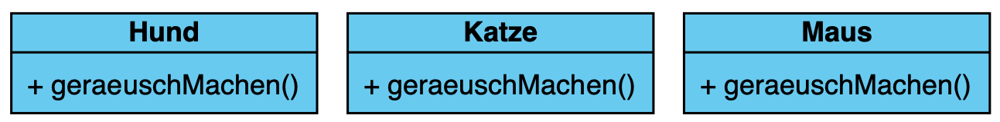
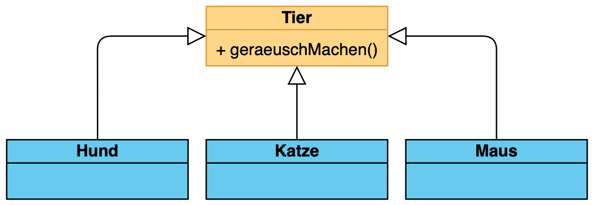
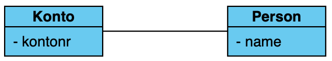
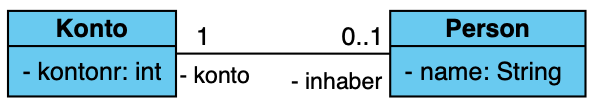
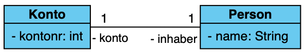
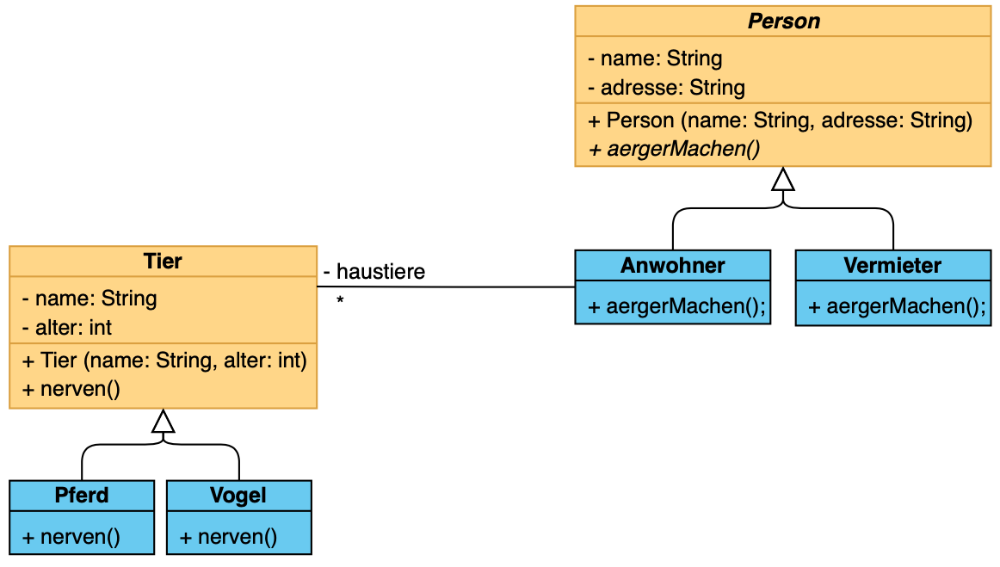

# Klausur
24.11.2020

## ToC:
- [Klausur](#klausur)
  - [ToC:](#toc)
  - [Polymorphie](#polymorphie)
      - [Begriffe und Schlüsselwörter](#begriffe-und-schlüsselwörter)
          - [Superclass / Superklasse](#superclass--superklasse)
          - [super](#super)
          - [Polymorphie](#polymorphie-1)
          - [Methodenüberschreibungen](#methodenüberschreibungen)
  - [Abstrakte Klassen](#abstrakte-klassen)
      - [Instanziieren von Abstrakten Klassen](#instanziieren-von-abstrakten-klassen)
  - [Beziehungen](#beziehungen)
    - [1:0..1](#101)
    - [1:1](#11)
    - [1:n](#1n)
  - [Klassendiagramm -> Java](#klassendiagramm---java)
    - [Klassen](#klassen)
      - [Person](#person)
      - [Person und Vermieter](#person-und-vermieter)
      - [Tier, Pferd und Vogel](#tier-pferd-und-vogel)
      - [(Beziehungen)](#beziehungen-1)
    - [Endresultat](#endresultat)

---

## Polymorphie
Nehmen wir an, wir möchten unsere Haustiere als Klasse ausdrücken:


Nun müssten wir 3 Klassen erstellen mit dem gleichen Methoden Namen:
```java
class Hund {
    public void geraeuschMachen() {
        System.out.println("Wau!");
    }
}
class Katze {
    public void geraeuschMachen() {
        System.out.println("Miau!");
    }
}
class Maus {
    public void geraeuschMachen() {
        System.out.println("(was macht ne Maus lol");
    }
}
```

Würden wir diese 3 Tiere nun z.B. in einem Array speichern möchten, sähe das folgendermaßen aus:
```java
public Hund[] haustiereHunde = new Hund[] {
    new Hund()
}:
public Katze[] haustiereKatzem = new Katze[] {
    new Katze()
}:
public Maus[] haustiereHunde = new Maus[] {
    new Maus()
}:
```

Je mehr Haustiere wir nun erstellen, desto aufwändiger wird das Ganze.  
Um diese fehleranfällige Schreibarbeit zu erleichtern, erstellen wir eine Klasse "Tier" mit der Methde "geraeuschMachen" und lassen Hund, Katze und Maus von ihr erben:


Der Code sieht nun so aus:
```java
class Tier {

}

class Hund extends /* <- Vererbung wird durch das Wort "extends" angezeigt */ Tier {

}
class Katze extends Tier {

}
class Maus extends Tier {

}
```

#### Begriffe und Schlüsselwörter
###### Superclass / Superklasse
Die Klasse von der geerbt wird, also **Tier**

###### super
Mit dem super-Schlüsselwort kann man von einer Unterklasse (wie Hund) auf Attribute und Methoden der Superklasse zugreifen:
```java
class Tier { // Superklasse
    public String name;
}
class Hund extends Tier {
    public Hund() {
        super.name = "Hund";
    }
}
```
`super.name` greift also auf das Attribut `name` der Klasse `Tier` zu.

Dies gilt auch für Methoden:
```java
class Auto {
    public void anDasTeil() {
        System.out.println("Starte den Motor vom Auto ...");
    }
}

class BMW {
    @Override
    public void anDasTeil() {
        super.anDasTeil();
        System.out.println("Ist jetzt an!");
    }
}

class Audi {
    @Override
    public void anDasTeil() {
        System.out.println("Kaputt!");
    }
}
```
gibt aus:
```java
Auto auto = new Auto();
Auto bmw = new BMW();
Auto audi = new Audi();

// Gibt "Starte den Motor vom Auto ..." aus
auto.anDasTeil();

// Gibt "Starte den Motor vom Auto ..." UND "Ist jetzt an!" aus
bmw.anDasTeil();

// Gibt "Kaputt!" aus
audi.anDasTeil();
```

Mit dem `super` Schlüsselwort kann man also auch auf die "originalen" Methoden der Superklasse zugreifen.
Bei BMW wird so erst die Methode `anDasTeil` der Klasse `Auto` und dann erst `anDasTeil` der Klasse `BMW` aufgerufen.

###### Polymorphie
Nun kann man alle Haustiere durch **Polymorphie** in einem einzigen Array speichern, da alle Haustiere von der selben Klasse vererbt sind.
```java
public Tier[] haustiere = new Tier[] {
    new Hund(),
    new Katze(),
    new Maus()
};

// andere (explizite) Schreibweise:
public Tier[] haustiere = new Tier[3];
haustiere[0] = new Hund();
haustiere[1] = new Katze();
haustiere[2] = new Maus();
```

###### Methodenüberschreibungen
Die Superklasse enthält die Methode "geraeuschMachen":
```java
class Tier {
    public void gerausch() {
        System.out.println("Nicht implementiert!");
    }
}
```

Nun kann man diese Methode in den Unterklassen überschreiben.
Dafür nutzt man der Konventions-willen das Schlüsselwort `@Override`, welches man aber auch weglassen kann.
Es hilft jedoch dem Entwickler auf den ersten Blick zu sehen, welche Methoden der Superklasse überschrieben wurden.
```java
/**
  * Klasse welche die Methode überschreibt
  */
class Hund extends Tier {
    @Override // <-- Kann wie gesagt weggelassen werden, hilft aber enorm
    public void geraeusch() {
        System.out.println("Wau!");
    } 
}

/**
  * Klasse welche die Methode NICHT überschreibt
  */
class Katze extends Tier {

}
```

Wir haben nun zwei Klassen. Hund, welche die Methode der Superklasse "geraeusch" überschreibt, und Katze, welche die Methode nicht überschreibt:
```java
Tier hund = new Hund();
Tier katze = new Katze();

// Gibt "Wau!" aus. Es wird auf die Methode `geraeusch` der Klasse `Hund` zugegriffen
hund.geraeusch();

// Gibt "Nicht implementiert!" aus. Es wird auf die Methode `geraeusch` der Klasse `Tier` zugefiriffen.
katze.geraeusch(); 
```

## Abstrakte Klassen
In dem vorherigen Beispiel hatten wir die Nachricht 

> Nicht implementiert!

ausgeben lassen, wenn wir die Methode in den Unterklassen nicht explizit überschrieben haben.
Möchten wir den Entwickler dazu **zwingen** diese Methode zu überschreiben, nutzen wir **abstrakte Klassen** oder **Interfaces** 

> (Interfaces hatten wir noch nicht, daher überspringe ich das hier erstmal.)


Es wird die Klasse als **abstrakt** deklariert, welche die Methoden enthält, die überschrieben werden sollen. Also in diesem Fall **Tier**
```java
abstract class Tier {

}
```
Ein Klasse wird durch das Schlüsselwort **abstract** als abstrakt markiert.

Nun kann man in die Klasse mit folgendem Syntax hinterlegen, welche Methoden in den Unterklassen implementiert werden müssen:

```java
abstract class Tier {
    public abstract void gerausch();
}
```

Wieder durch das Schlüsselwort **abstract** wird auch die Methode als abstrakt gekennzeichet.
Wie man nun sieht, enthält die Methode keinen **Body** (Rumpf), sondern wird mit einem `;` "beendet".
Nun muss ich in jeder Klasse, welche von der Klasse `Tier` erbt, diese Methode implementiert werden:

```java
class Hund extends Tier {
    @Override
    public void geraeusch() {
        System.out.println("Wau!");
    }
}

class Maus extends Tier {
    // Der Compiler würde hier ein Fehler werfen, weil wir die Methode `Tier` nicht implementieren.
}
```

#### Instanziieren von Abstrakten Klassen
Eine abstrakte Klasse kann **NICHT** wie eine "normale" Klasse instanziiert werden:
```java
class TierNormal {
    public void gerausch() {

    }
}
abstract class TierAbstrakt {
    public abstract void gerausch();
}
```

```java
TierNormal normal = new TierNormal(); // funktioniert
TierAbstrakt abstrakt = new TierAbstrakt(); // funktioniert NICHT, der Compiler wirft einen Fehler.
```

Man kann eine abstrakte Klasse nur dann "instanziieren", wenn eine Klasse von ihr erbt:
```java
abstract class TierAbstrakt {
    public abstract void gerausch();
}
class Hund extends TierAbstrakt {
    @Override 
    public void geraeusch() {

    }
}
```

```java
Hund hund = new Hund(); // ☑️
TierAbstrakt hund2 = new Hund(); // ☑️
TierAbstrakt hund3 = new TierAbstrakt(); // ⚠️ geht nicht
```

die einzige Möglichkeit eine abstrakte Klasse zu "instanziieren" sind durch sog. "anonymous classes". Da wir das aber noch nicht im Unterricht haben, möchte ich darauf nicht weiter eingehen, da sie aber später nützlich sein können, wollte ich es nicht unerwähnt lassen.

## Beziehungen
Es gibt hauptsächlich 3 Beziehungen, die wir im Unterricht durchgenommen haben:
* 1:0..1
* 1:1
* 1:n

Bei jeder dieser Beziehungen wird ein neues Attribut in eine Klasse hinzugefügt, welches die jeweils andere Seite beinhaltet:



### 1:0..1
Die 1:0..1 - Beziehung ist die Einfachste. Eine Klasse beinhaltet ein oder kein Objekt der anderen Klasse.

**In dem o. g. Beispiel von Konto und Person:**  
Ein Konto hat **einen** oder **keinen** Kontoinhaber.

Hierzu fügt man lediglich ein Attribut in die Klasse hinzu, bei der die "1" steht, also **Konto**, denn Konto: 1, Person: 0..1



```java
class Person {
    private String name;
}
class Konto {
    private int kontonr;

    // 1:0..1 Beziehung:
    private Person inhaber;
}
```

`Konto.inhaber` kann nun eine Person, ODER `null` sein. Also ein, oder kein Inhaber.

### 1:1
Bie der 1:1 Beziehung MUSS ein Konto einer Person zugeordnet werden:


Das wird erreicht, in dem man im **Kontruktor** daen Inhaber angeben muss:
```java
class Person {
    private String name;
}
class Konto {
    private int kontonr;

    // 1:1 Beziehung:
    private Person inhaber;

    public Konto (Person inhaber) {
        this.inhaber = inhaber;
    }
}
```

### 1:n
Bei der 1:n Beziehung kann ein Konto beliebig viele Kontoinhaber haben.
In dem Beispiel mal 1:10, also 1 Konto kann 10 Kontoinhaber haben. Wir sind in dem Fall auf ein Limit von 10 angewiesen, da wir die Kontoinhaber in einem Array speichern möchten, welches von uns eine größe erwartet.

```java
class Person {
    private String name;
}
class Konto {
    private int kontonr;

    // 1:n (1:10) Beziehung:
    private Person[] inhaber = new Person[10];
}
```

## Klassendiagramm -> Java
Im Folgenden möchten wir dieses Klassendiagramm in Java übernehmen


Als Erstes würde ich mit der Hierachie ganz oben anfangen. Also Superklassen zuerst, welche nicht woders erben. In diesem Fall: **Person** und **Tier**. Wobei **Tier** eine direkte Beziehung hat mit einem **Anwohner** welcher von Person vererbt, also fange ich mit **Person** an, da diese Klasse "frei" von Beziehungen nach oben ist.

### Klassen
#### Person
Was bei dieser Klasse auffällt ist der kursive Name der Klasse, heißt: [Abstrakte Klasse](#abstrakte-klassen).

```java
abstract class Person {

}
```

Als nächstes fügen wir die Attribute hinzu.
Hier achten wir auf die Vorzeichen:
* `+` -> `public`
* `-` -> `private`
* `~` -> `protected`
steht nichts davor, heißt das "package", also müssen wir auch in Java nichts weiter hinschreiben.
Diesen **Access Modifier** schreiben wir am Anfang des Attributes.

Als nächstes schauen wir, was das Attribut für einen Namen hat. Diesen merken wir uns aber erstmal, denn es fehlt noch der Typ des Attributs. Der Typ steht direkt hinter dem `:`, also in dem Fall `String`

Nun schreiben wir das Attribut als `[Access Modifier]` `[Typ]` `[Name]` auf:

```java
abstract class Person {
    // -    Typ    Name
    private String name;
    private String adresse;
}
```

Nun zu den **Operationen** (also Methoden und Konstruktor)

Der Konstruktor erkennen wir daran, dass er den selben Namen wie die Klasse hat.
```java
abstract class Person {
    // -    Typ    Name
    private String name;
    private String adresse;

    // +   Klassenname
    public Person() {

    }
}
```
jetzt fehlen noch die Parameter der Klasse Person.
Die können wir fast aus dem Klassendiagramm abschreiben. Nur dass wir alles nach dem `:` vor dem Namen setzen.

`(name: String, adresse: String)` wird also zu `(String name, String adresse)`.
Die Attribute der Klasse weisen wir dann noch den Parametern zu mit `this.[attribut] = [parameter]`:

```java
abstract class Person {
    // -    Typ    Name
    private String name;
    private String adresse;

    // +   Klassenname
    public Person(String name, String adresse) {
        this.name = name;
        this.adresse = adresse;
    }
}
```

Jetzt haben wir die Attribute und den Konstruktor. Nun fehlen noch die Methoden. In dem Klassendiagramm steht *aergerMachen()* in kursiv und **ohne Rückgabewert** (kein `: [irgendwas]` und auch nicht `: void` dahinter). Hier ist es wichtig, dass man beachtet, dass die Methode *kursiv* geschrieben wurde, was heißt: **abstrakte Methode**

```java
abstract class Person {
    // -    Typ    Name
    private String name;
    private String adresse;

    // +   Klassenname
    public Person(String name, String adresse) {
        this.name = name;
        this.adresse = adresse;
    }

    // + | abstrakt | (ohne Typ) | Name d. Methode
    public abstract void aergerMachen();
}
```

Fertig!

Als nächstes widmen wir uns den Unterklassen von `Person`

#### Person und Vermieter
Diese Klassen erben von `Person`, welches wir mit `extends` ausdrücken:
```java
class Anwohner extends Person {

}
class Vermieter extends Person {

}
```

⚠️ **Nicht vergessen**: Die Superklasse `Person` erwartet einen Konstruktor mit den Parametern `(String name, String adresse)` also müssen wir diesen in den Unterklassen ergänzen, bzw. ausfüllen:

```java
class Anwohner extends Person {
    public Anwohner (String name, String adresse) {
        super (name, adresse);
    }
}
class Vermieter extends Person {
    public Anwohner (String name, String adresse) {
        super (name, adresse);
    }
}
```

`super (name, adresse)` greift hierbei wie bei [super](#super) auf den Konstruktor der Superklasse zu. Man kann sich das vorstellen, als stände da:
```java
public Anwohner (String name, String adresse) {
    this.name = name;
    this.adresse = adresse;
}
```
(**Achtung**, das ist nicht ganz korrekt aufgeschrieben. Es dient lediglich zur Veranschaulichung!).

Also umbedingt an den Konstruktor denken, wenn einer angegeben wurde.

Nun übernehmen wir die Methoden.
```java
class Anwohner extends Person {
    public Anwohner (String name, String adresse) {
        super (name, adresse);
    }

    @Override
    public void aergerMachen() {

    }
}
class Vermieter extends Person {
    public Anwohner (String name, String adresse) {
        super (name, adresse);
    }

    @Override
    public void aergerMachen() {
        
    }
}
```
(**Hinweis**: Ich habe `@Override` über die Methoden geschrieben, um zu verdeutlichen, dass hier Methoden der Superklasse überschrieben werden. Das muss nicht zwingend hingeschrieben werden, kann aber zur Übersicht helfen.)

#### Tier, Pferd und Vogel
Das gleiche machen wir jetzt für `Tier`, `Pferd` und `Vogel`. Der Klassenname von Tier wurden icht kursiv geschrieben, also ist diese Klasse auch nicht abstrakt. Wir haben also insgesamt:

```java
class Tier {
    private String name;
    private int alter;

    public Tier (String name, int alter) {
        this.name = name;
        this.alter = alter;
    }

    public void nerven() {
        
    }
}

class Pferd extends Tier {
    public Pferd (String name, int alter) {
        super (name, alter);
    }

    @Override
    public void nerven() {

    }
}

class Vogel extends Tier {
    public Vogel (String name, int alter) {
        super (name, alter);
    }

    @Override
    public void nerven() {

    }
}
```

#### (Beziehungen)
Zu guter Schluss noch die Beziehungen.

Ein Anwohner kann beliebig viele Haustiere haben. Daher fügen wir durch die 1:n Beziehung ein Array zu Anwohner hinzu.

```java
class Anwohner extends Person {
    private Tier[] haustiere = new Tier[512]; // z.B. 512, also max. 512 Tiere.
    // Wichtig: Da wir aktuell nur Arrays zum Speichern einer "Liste" kennen, 
    // umbedingt daran denken, dass Arrays eine Grenze erwarten. In dem Fall also 512.
    // private Tier[] haustiere = new Tier[]; <-- geht nicht!

    public Anwohner (String name, String adresse) {
        super (name, adresse);
    }

    @Override
    public void aergerMachen() {

    }
}
```

**Fertig**
Wir haben das Klassendiagramm erfolgreich übernommen. 

Da wir keine Aufgabenstellung zu den Methoden hatten, lassen wir diese einfach leer.
In nächsten Schritt, hätte man eine Aufgabenstellug dazu, würde man diese Methoden nun mit Logik füllen.
Bei `Anwohner#aergerMachen()` zum Beispiel:
```java
class Anwohner extends Person {
    private Tier[] haustiere = new Tier[512];

    public Anwohner (String name, String adresse) {
        super (name, adresse);
    }

    @Override
    public void aergerMachen() {
        System.out.println("Person ist laut!");
    }
}
```

### Endresultat
```java
abstract class Person {
    private String name;
    private String adresse;
    public Person(String name, String adresse) {
        this.name = name;
        this.adresse = adresse;
    }

    public abstract void aergerMachen();
}

class Anwohner extends Person {
    private Tier[] haustiere = new Tier[512];

    public Anwohner (String name, String adresse) {
        super (name, adresse);
    }

    @Override
    public void aergerMachen() {

    }
}
class Vermieter extends Person {
    public Anwohner (String name, String adresse) {
        super (name, adresse);
    }

    @Override
    public void aergerMachen() {
        
    }
}

class Tier {
    private String name;
    private int alter;

    public Tier (String name, int alter) {
        this.name = name;
        this.alter = alter;
    }

    public void nerven() {
        
    }
}

class Pferd extends Tier {
    public Pferd (String name, int alter) {
        super (name, alter);
    }

    @Override
    public void nerven() {

    }
}

class Vogel extends Tier {
    public Vogel (String name, int alter) {
        super (name, alter);
    }

    @Override
    public void nerven() {

    }
}
```